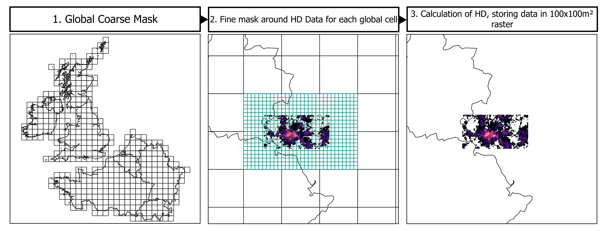
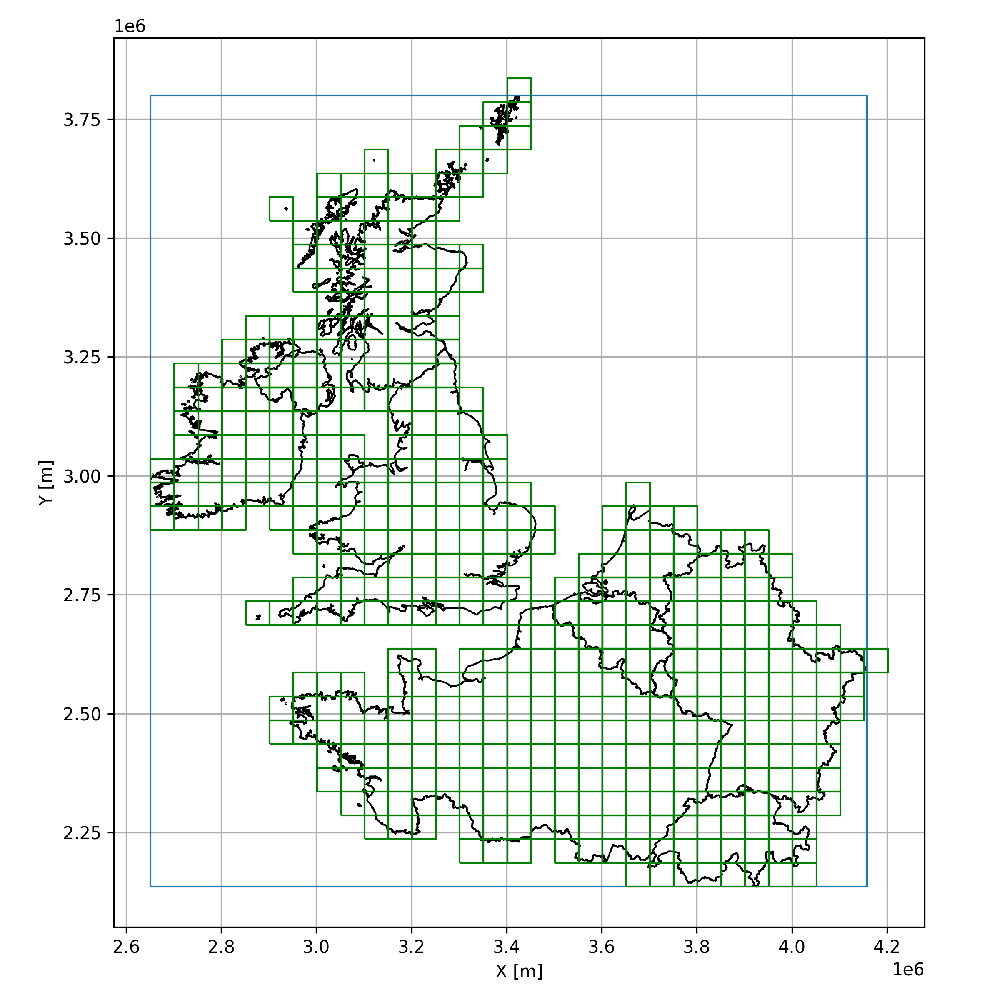
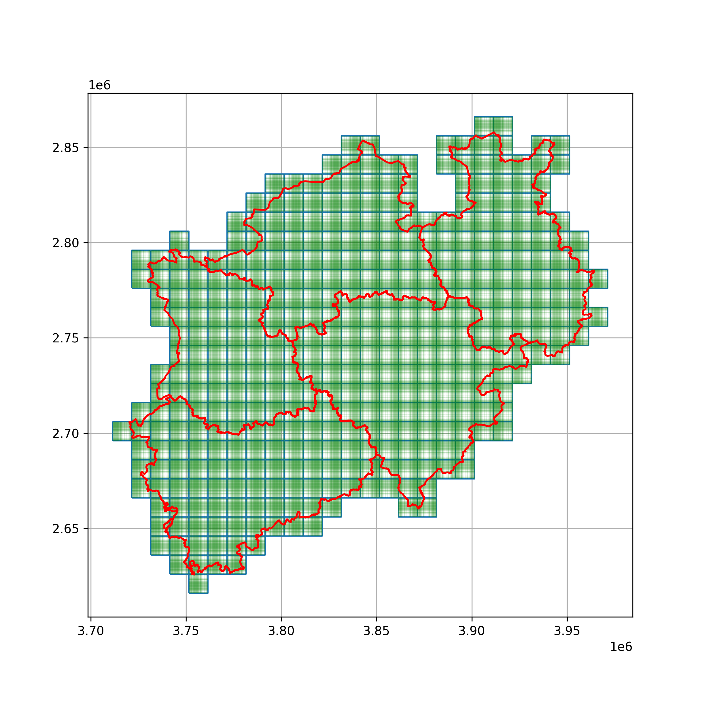
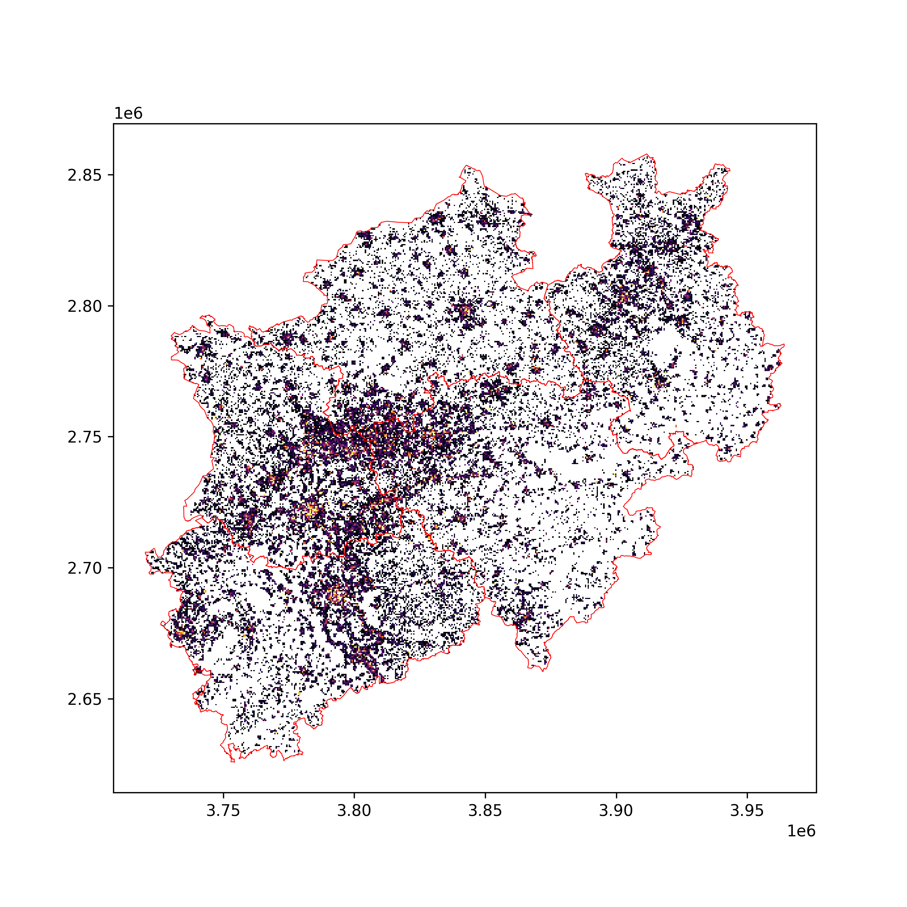

.. _hd_ref:

Calculation of Heat Demand
==========================

Space and water heating for residential and commercial buildings amount to a third of the European Union’s total final
energy consumption. Approximately 75% of the primary energy and 50% of the thermal energy are still produced by burning
fossil fuels, leading to high greenhouse gas emissions in the heating sector. The transition from centralized
fossil-fueled district heating systems such as coal or gas power plants to district heating systems sourced by renewable
energies such as geothermal energy or more decentralized individual solutions for city districts makes it necessary to
map the heat demand for a more accurate planning of power plant capabilities. In addition, heating and cooling plans
become necessary according to directives of the European Union regarding energy efficiency to reach its aim of reducing
greenhouse gas emissions by 55% of the 1990 levels by 2030.

Evaluating the heat demand (usually in MWh = Mega Watt Hours) on a national or regional scale, including space and water heating for each apartment or each
building for every day of a year separately is from a perspective of resolution (spatial and temporal scale) and computing power
not feasible. Therefore, heat demand maps summarize the heat demand on a lower spatial resolution (e.g. 100 m x 100 m
raster) cumulated for one year (lower temporal resolution) for different sectors such as the residential and tertiary
sectors. Maps for the industrial heat demand are not available as the input data is not publicly available or can be deduced from cultural data. Customized
solutions are therefore necessary for this branch to reduce greenhouse gas emissions. Heat demand input values for the
residential and commercial sectors are easily accessible and assessable. With the new directives regarding energy
efficiency, it becomes necessary for every city or commune to evaluate their heat demand. And this is where **PyHeatDemand**
comes into place. Combining the functionality of well-known geospatial Python libraries, the open-source package **PyHeatDemand** provides tools for public entities, researchers, or students for processing heat demand input data associated with an

administrative area (`point <https://shapely.readthedocs.io/en/stable/reference/shapely.Point.html>`_ or `polygon <https://shapely.readthedocs.io/en/stable/reference/shapely.Polygon.html>`_), with a building footprint (`polygon <https://shapely.readthedocs.io/en/stable/reference/shapely.Polygon.html>`_), with a street segment (`line <https://shapely.readthedocs.io/en/stable/reference/shapely.LineString.html>`_), or with an
address directly provided in MWh but also as gas usage, district heating usage, or other sources of heat. The resulting
heat demand map data can be analyzed using zonal statistics and can be compared to other administrative areas when working
on regional or national scales. If heat demand maps already exist for a specific region, they can be analyzed using tools within **PyHeatDemand**.
With **PyHeatDemand**, it has never been easier to create and analyze heat demand maps.

Demonstration Notebooks for Heat Demand Calculations
----------------------------------------------------

Several Jupyter Notebooks are available that demonstrate the functionality of **PyHeatDemand**.

.. toctree::
   :maxdepth: 1
   :caption: Examples

   notebooks/01_Interreg_NWE_Mask_10km
   notebooks/02_Processing_Data_Type_I_Raster
   notebooks/03_Processing_Data_Type_I_Vector
   notebooks/04_Processing_Data_Type_II_Vector_Polygons
   notebooks/05_Processing_Data_Type_II_Vector_Lines
   notebooks/06_Processing_Data_Type_III_Point_Coordinates
   notebooks/07_Processing_Data_Type_III_Point_Data_Addresses
   notebooks/08_Processing_Data_Type_IV_Vector_Polygons
   notebooks/09_Processing_Data_Type_III_Point_Coordinates
   notebooks/10_Processing_Data_Type_V_No_Heat_Demand_Values
   notebooks/11_Processing_Data_Merging_and_Stitching_Resulting_Rasters
   notebooks/12_Processing_Results
   notebooks/13_Processing_and_merging_heat_demand_data_for_NRW

Processing Heat Demand Input Data
---------------------------------

Heat demand maps can be calculated using either a top-down approach or a bottom-up approach (Fig. 1). For the top-down approach,
aggregated heat demand input data for a certain area will be distributed according to higher resolution data sets (e.g. population density, landuse, etc.).
In contrast to that, the bottom-up approach allows aggregating heat demand of higher resolution data sets to a lower resolution (e.g. from building level to a 100 m x 100 m raster).

.. image:: ../images/fig0.png

**PyHeatDemand** processes geospatial data such as vector data (`points <https://shapely.readthedocs.io/en/stable/reference/shapely.Point.html>`_, `lines <https://shapely.readthedocs.io/en/stable/reference/shapely.LineString.html>`_, `polygons <https://shapely.readthedocs.io/en/stable/reference/shapely.Polygon.html>`_), raster data or address data. Therefore,
we make use of the functionality implemented in well-known geospatial packages such as `GeoPandas <https://geopandas.org/en/stable/>`_,
`Rasterio <https://rasterio.readthedocs.io/en/stable/>`_, `GeoPy <https://geopy.readthedocs.io/en/stable/>`_, or `OSMnx <https://osmnx.readthedocs.io/en/stable/>`_
and their underlying dependencies such as `Pandas <https://pandas.pydata.org/>`_, `NumPy <https://numpy.org/>`_, `Shapely <https://shapely.readthedocs.io/en/stable/manual.html>`_, etc.

The creation of a heat demand map follows a general workflow (Fig. 2) followed by a data-category-specific workflow for five defined
input data categories (Fig. 3 & 4). The different input data categories are listed in the table below.

+---------------+-----------------------------------------------------------------------------------------------------------------------------+
| Data category |      Description                                                                                                            |
+---------------+-----------------------------------------------------------------------------------------------------------------------------+
| 1             | HD data provided as 100 m x 100 m raster or polygon grid with the same or in a different coordinate reference system        |
+---------------+-----------------------------------------------------------------------------------------------------------------------------+
| 2             | HD data provided as building footprints or street segments                                                                  |
+---------------+-----------------------------------------------------------------------------------------------------------------------------+
| 3             | HD data provided as a point or polygon layer, which contains the sum of the HD for regions of official administrative units |
+---------------+-----------------------------------------------------------------------------------------------------------------------------+
| 4             | HD data provided in other data formats such as HD data associated with addresses                                            |
+---------------+-----------------------------------------------------------------------------------------------------------------------------+
| 5             | No HD data available for the region                                                                                         |
+---------------+-----------------------------------------------------------------------------------------------------------------------------+

Creating Global Mask
~~~~~~~~~~~~~~~~~~~~~

Depending on the scale of the heat demand map (local, regional, national, or even transnational), a global `polygon <https://shapely.readthedocs.io/en/stable/reference/shapely.Polygon.html>`_ mask is created from provided administrative boundaries with a cell size of
10 km by 10 km, for instance, and the target `coordinate reference system <https://docs.qgis.org/3.28/en/docs/gentle_gis_introduction/coordinate_reference_systems.html>`_.
This mask is used to divide the study area into smaller chunks for a more reliable processing
as only data within each mask will be processed separately. If necessary, the global mask will be cropped to the extent of the
available heat demand input data.

.. code-block:: python

    # Creating global 10 km x 10 km mask and cropping it to the borders of the provided administrative areas.
    # NB: The image below shows cells with a size of 50 km x 50 km for better visualization.
    from pyheatdemand import processing
    import geopandas as gpd

    borders = gpd.read_file('path/to/borders.shp')
    mask_10km = processing.create_polygon_mask(gdf=borders, step_size=10000, crop_gdf=True)

Creating Local Mask
~~~~~~~~~~~~~~~~~~~

The global mask will be populated with `polygons <https://shapely.readthedocs.io/en/stable/reference/shapely.Polygon.html>`_ having already the final cell size such as 100 m x 100 m. Prior to that we are using a spatial join to crop the global mask to the extent of one administrative unit.

.. code-block:: python

    # Performing spatial join to crop global mask to outline of one administrative unit
    outline_administrative_unit = gpd.read_file('path/to/outline.shp')
    mask_10km_cropped = mask_10km.sjoin(outline_administrative_unit).reset_index(drop=True).drop('index_right', axis=1)
    mask_10km_cropped = mask_10km_cropped.drop_duplicates().reset_index(drop=True)

    # Creating local 100 m x 100 m mask for one of the administrative areas
    mask_100m_cropped = [processing.create_polygon_mask(gdf=mask_10km[i:i+1],
                                                   step_size=100,
                                                   crop_gdf=True) for i in tqdm(range(len(mask_10km_cropped)))]
    mask_100m = pd.concat(mask_100m_cropped)

Calculating Heat Demand
~~~~~~~~~~~~~~~~~~~~~~~~~~~
For each cell, the cumulated heat demand in each cell will be calculated.

.. code-block:: python

    gdf_hd = gpd.read_file('path/to/hd_data.shp')
    heat_demand_list = [processing.calculate_hd(hd_gdf=gdf_hd, mask_gdf=mask_100m_cropped[i], hd_data_column='HD_column') for i in tqdm(range(len(mask_100m_cropped)))]
    heat_demand = pd.concat(heat_demand_list).reset_index(drop=True)

Rasterizing Heat Demand
~~~~~~~~~~~~~~~~~~~~~~~

The final `polygon <https://shapely.readthedocs.io/en/stable/reference/shapely.Polygon.html>`_ grid will be rasterized and merged with adjacent global cells
to form a mosaic, the final heat demand map. If several input datasets are available for a region, i.e. different sources of energy, they can either be included
in the calculation of the heat demand or the resulting rasters can be added to a final heat demand map.

.. code-block:: python

    processing.rasterize_gdf_hd(heat_demand,
                     path_out='path/to/heat_demand.tif',
                     crs = 'EPSG:3034',
                     xsize = 500,
                     ysize = 500)

Processing data categories 1 and 2
~~~~~~~~~~~~~~~~~~~~~~~~~~~~~~~~~~

The data processing for data categories 1 and 2 are very similar (Fig. 3) and correspond to a bottom-up approach. In the case of a raster for category 1, the raster is converted into gridded `polygons <https://shapely.readthedocs.io/en/stable/reference/shapely.Polygon.html>`_.
Gridded `polygons <https://shapely.readthedocs.io/en/stable/reference/shapely.Polygon.html>`_ and building footprints are treated equally. The `polygons <https://shapely.readthedocs.io/en/stable/reference/shapely.Polygon.html>`_ containing the heat demand data are, if necessary,
reprojected to the `coordinate reference system <https://docs.qgis.org/3.28/en/docs/gentle_gis_introduction/coordinate_reference_systems.html>`_ and are overlain with the local mask (e.g. 100 m x 100 m cells).
This cuts each heat demand `polygon <https://shapely.readthedocs.io/en/stable/reference/shapely.Polygon.html>`_ with the respective mask `polygon <https://shapely.readthedocs.io/en/stable/reference/shapely.Polygon.html>`_. The heat demand of each subpolygon is proportional to its area compared to the area of the original `polygon <https://shapely.readthedocs.io/en/stable/reference/shapely.Polygon.html>`_.
The heat demand for all subpolygons in each cell is aggregated to result in the final heat demand for this cell.

.. image:: ../images/fig2.png

Processing data category 3
~~~~~~~~~~~~~~~~~~~~~~~~~~~~~~~~~~

The data processing for data category 3 corresponds to a top-down approach. The heat demand represented as points for an administrative unit will be distributed across the area using higher-resolution data sets.
In the case illustrated below, the distribution of `Hotmaps <https://www.hotmaps-project.eu/>`_ data is used to distribute the available heat demands for the given administrative areas.
For each administrative area, the provided total heat demand will distributed according to the share of each `Hotmaps <https://www.hotmaps-project.eu/>`_ cell compared to the total `Hotmaps <https://www.hotmaps-project.eu/>`_ heat demand of the respective area.
The provided heat demand is now distributed across the cells and will treated from now on as category 1 or 2 input data to calculate the final heat demand map.

.. image:: ../images/fig3.png

Processing data category 4
~~~~~~~~~~~~~~~~~~~~~~~~~~~~~~~~~~

The data processing for data category 4 corresponds to a bottom-up approach. Here, the addresses will be converted using the `GeoPy <https://geopy.readthedocs.io/en/stable/>`_ geolocator to coordinates.
Based on these, the building footprints are extracted from OpenStreet Maps using `OSMnx <https://osmnx.readthedocs.io/en/stable/>`_. From there on, the data will be treated as data category 2.

Processing data category 5
~~~~~~~~~~~~~~~~~~~~~~~~~~~~~~~~~~

If no heat demand input data is available, the heat demand can be estimated using cultural data such as population density, landuse, and building-specific heat usage.

Processing Heat Demand Map Data
-------------------------------

Heat demand maps may contain millions of cells. Evaluating each cell would not be feasible. Therefore, **PyHeatDemand** utilizes the `rasterstats <https://github.com/perrygeo/python-rasterstats/>`_ package returning statistical values of the heat demand map for further analysis and results reporting.

.. code-block:: python

    gdf_stats = processing.calculate_zonal_stats('path/to/vector.shp',
                                                 'path/to/heat_demand.tif',
                                                 'EPSG:3034')
    gdf_stats['coords'] = gdf_stats['geometry'].apply(lambda x: x.representative_point().coords[:])
    gdf_stats['coords'] = [coords[0] for coords in gdf_stats['coords']]

.. image:: ../images/fig_methods5.png
